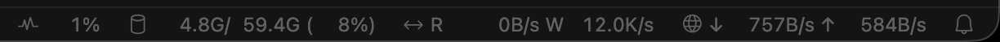

# SSH System Monitor

A VSCode extension that displays live system utilization in the bottom status bar **when you're connected to a remote host** (Remote-SSH, WSL, Dev Containers). Lightweight, fully configurable, no native dependencies.

## What it shows


Per-metric status bar items, each with a tooltip that breaks down per-device numbers:

- **CPU** — busy %, optional load average
- **Memory** — used / total, %
- **GPU** — utilization (and optionally memory, temperature, power) for NVIDIA, AMD, Intel, and Apple Silicon
- **Disk** — aggregated read / write throughput (per-device in tooltip)
- **Network** — aggregated rx / tx throughput (per-device in tooltip)

Click any item to open the full detail report in the *SSH System Monitor* output channel.

## How it works

- Runs as a `workspace` extension (`extensionKind: ["workspace"]`), so it executes on the **remote** side, never sampling your laptop.
- Activates on startup; if `vscode.env.remoteName` is undefined and `sshMonitor.runOnLocal` is `false` (default), the extension stays idle.
- Samples every `sshMonitor.intervalMs` (default 2000 ms) using shell-out and `/proc` reads — no native add-ons.
- Linux and macOS remotes are supported.

## Sampling sources

| Metric | Linux | macOS |
|---|---|---|
| CPU | `/proc/stat` delta | `top -l 1 -n 0` |
| Memory | `/proc/meminfo` | `vm_stat` + `sysctl hw.memsize` |
| Disk | `/proc/diskstats` delta | `iostat -dI` (cumulative) |
| Network | `/proc/net/dev` delta | `netstat -ibn` |
| GPU (NVIDIA) | `nvidia-smi --query-gpu=…` | same |
| GPU (AMD) | `rocm-smi --json` | n/a |
| GPU (Intel) | `intel_gpu_top -J` | n/a |
| GPU (Apple) | n/a | `powermetrics --samplers gpu_power` *(requires sudo)* |

## Configuration

All settings live under `sshMonitor.*`. A small selection:

| Setting | Default | Notes |
|---|---|---|
| `sshMonitor.enabled` | `true` | Master switch. |
| `sshMonitor.intervalMs` | `2000` | 500 – 60000 ms. |
| `sshMonitor.runOnLocal` | `false` | Set to `true` to run in non-remote windows. |
| `sshMonitor.statusBar.alignment` | `right` | `left` or `right`. |
| `sshMonitor.statusBar.order` | `["cpu","memory","gpu","disk","network"]` | Drop entries to hide. |
| `sshMonitor.statusBar.colorize` | `true` | Yellow on warn, red on crit. |
| `sshMonitor.statusBar.iconStyle` | `codicon` | `codicon`, `text`, or `none`. |
| `sshMonitor.metrics.cpu.format` | `percent` | `percent`, `load`, or `both`. |
| `sshMonitor.metrics.memory.format` | `both` | `percent`, `used`, or `both`. |
| `sshMonitor.metrics.disk.includePattern` | `""` | Regex (empty = all). |
| `sshMonitor.metrics.disk.excludePattern` | `^(loop\|ram\|sr\|fd\|dm-)` | Regex. |
| `sshMonitor.metrics.disk.showSeparateRW` | `true` | `R 12M/s W 4M/s` vs combined. |
| `sshMonitor.metrics.network.includePattern` | `""` | Regex. |
| `sshMonitor.metrics.network.excludePattern` | `^(lo\|docker\|veth\|br-\|cni\|utun\|…)` | Regex. |
| `sshMonitor.metrics.gpu.vendors` | `["auto"]` | Or any of `nvidia`/`amd`/`intel`/`apple`. |
| `sshMonitor.metrics.gpu.show` | `["util","mem"]` | Subset of `util`/`mem`/`temp`/`power`. |
| `sshMonitor.metrics.gpu.apple.sudoCommand` | `""` | e.g. `sudo -n` for Apple Silicon GPU sampling. |
| `sshMonitor.thresholds.cpu.warn` / `.crit` | `70` / `90` | Status bar color cutoffs. |
| `sshMonitor.thresholds.memory.warn` / `.crit` | `75` / `92` | |
| `sshMonitor.thresholds.gpu.warn` / `.crit` | `70` / `90` | |

Every setting is reactive — saving a change re-applies without a window reload.

## Commands

- **SSH Monitor: Show Details** — opens the output channel with a full per-device snapshot.
- **SSH Monitor: Refresh Now** — forces an immediate sample.
- **SSH Monitor: Toggle Enabled** — flips the master switch.

## Resilience

- Each spawn is bounded by `sshMonitor.commandTimeoutMs` (default 1500 ms).
- If a metric fails 3 ticks in a row it's muted for the session; the tooltip explains why and the output channel logs the underlying error. Saving any setting clears the mute.

## Build & run

```bash
npm install
npm run compile
```

Then press **F5** in VSCode to launch an *Extension Development Host*. From the host, **Remote-SSH: Connect to Host** to your remote target and the extension will start sampling there. To experiment locally, set `sshMonitor.runOnLocal: true` in user settings.

To package a `.vsix`:

```bash
npx @vscode/vsce package
```

## Notes & caveats

- Apple Silicon GPU sampling needs `powermetrics`, which requires sudo. Set `sshMonitor.metrics.gpu.apple.sudoCommand` to e.g. `sudo -n` (after configuring passwordless sudo for that command) to enable it.
- Intel GPU sampling via `intel_gpu_top` typically requires root on Linux. Without privileges, the Intel collector returns no data and is muted after three failures.
- `iostat -dI` on macOS reports cumulative I/O without splitting reads vs writes, so per-device read and write are reported as half of the totals each. Linux remotes get accurate per-direction numbers via `/proc/diskstats`.

## License

MIT.
